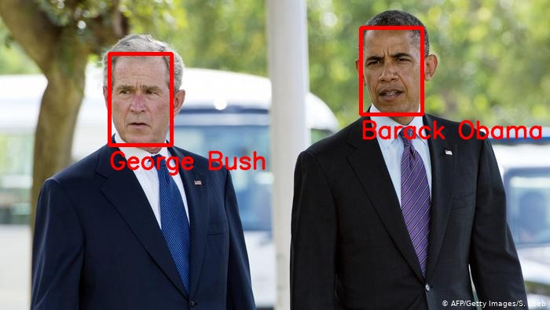

# FaceRecognition
### Introduction
The main goal of this repository is to compare different face detectors and face recognizers. This tool allows to store database with faces and their embeddings, find the most similar face from database by human photo. Code for result visualization is also provided. 

### Requirements
 [**PyTorch**](https://pytorch.org/) and [**Torchvision**](https://pytorch.org/) needs to be installed before running the scripts,  PyTorch v1.1 or later is supported. 

```bash
pip3 install -r requirements.txt
```

### Data structure
Provide the face images your want to detect in the `data/images_facebank` folder, and guarantee it has a structure like following:
```
data/images_facebank
        ---> id1/
            ---> id1_1.jpg
        ---> id2/
            ---> id2_1.jpg
        ---> id3/
            ---> id3_1.jpg
            ---> id3_2.jpg
```

### Demo

<br>
Run `face_verify.py --create_facebank` to get such pictures.
</br>


### Pretrained models
Download models and put them into directory `pretrained_models`. Don't forget to change path in `config.py`
[FaceNet (trained on VGG dataset) ](https://drive.google.com/uc?export=download&id=1TDZVEBudGaEd5POR5X4ZsMvdsh1h68T1)
[ArcFace](https://1drv.ms/u/s!AhMqVPD44cDOhkPsOU2S_HFpY9dC)
[RetinaFace](https://drive.google.com/open?id=1oZRSG0ZegbVkVwUd8wUIQx8W7yfZ_ki1)

### References
[1] [FaceNet](https://github.com/timesler/facenet-pytorch)
[2] [ArcFace](https://github.com/TreB1eN/InsightFace_Pytorch)
[3] [RetinaFace](https://github.com/biubug6/Pytorch_Retinaface)


