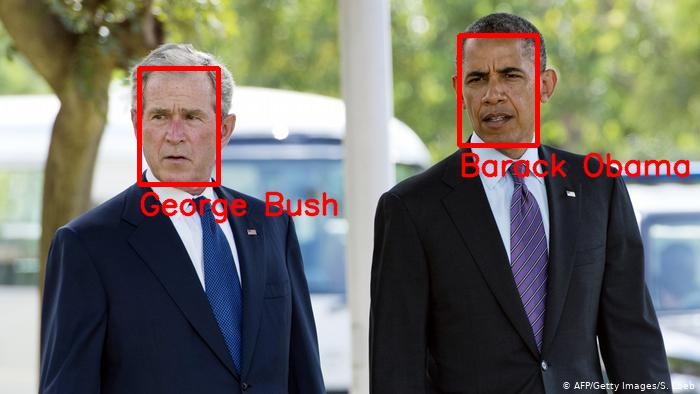

# FaceRecognition
### Introduction
The main goal of this repository is to compare different face detectors and face recognizers. This tool can help you to store database with faces and their embeddings, find the most similar face from database according to this embedding. Code for result visualization is also provided. 


### Demo


### Data structure
Provide the face images your want to detect in the data/images_facebank folder, and guarantee it has a structure like following:
```
data/images_facebank
        ---> id1/
            ---> id1_1.jpg
        ---> id2/
            ---> id2_1.jpg
        ---> id3/
            ---> id3_1.jpg
            ---> id3_2.jpg
```

### Pretrained models

### References
1. [FaceNet](https://github.com/timesler/facenet-pytorch)
2. [ArcFace](https://github.com/TreB1eN/InsightFace_Pytorch)
3. [RetinaFace](https://github.com/biubug6/Pytorch_Retinaface)


